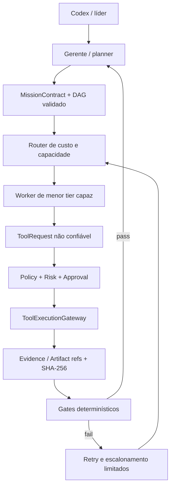
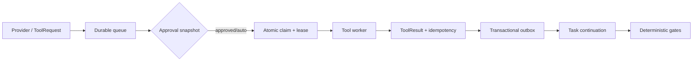

# Runtime multiagente verificável

O AI Office Suite separa decisão probabilística de execução factual. Modelos produzem contratos, decisões e `ToolRequest`; somente o runtime local produz `ToolResult` verificado e evidência com provenance.

## Contratos e confiança

`MissionContract` fixa objetivo, escopo, non-goals, decisões globais, budgets, limites e critérios. Cada `TaskContract` fixa permissões e critérios durante uma tentativa. Retry adiciona tentativa, evidência da falha e feedback sem substituir o contrato.

A precedência é: política do sistema, política da organização, contrato da missão, contrato da task, evidência do runtime, dados de dependências e sugestões de agentes. Conteúdo de dependências é dado não confiável e nunca eleva permissões.

## Tiers, custo e resiliência

Os tiers são independentes de fornecedor: T0 runtime determinístico, T1 local/mais barato, T2 remoto econômico, T3 gerente, T4 raciocínio forte. O router seleciona o menor tier disponível com capacidades suficientes. O orçamento reserva o pior custo antes da chamada. Circuit breaker, timeout e retries HTTP tratam disponibilidade sem contornar `policy_denied`, `approval_required` ou safety blocks.

## Execução local e evidência

Ferramentas são registradas com risco 0–4. O gateway aplica default-deny por política, aprovação e idempotência. Shell e paths passam por guards. Um self-report de modelo é `model_claim`; nunca satisfaz sozinho um gate de teste, build, Git, filesystem ou chamada externa. Simulação permanece marcada como `SIMULATION` e não vira evidência real.

O backend local implementa handlers separados para filesystem, repositório, shell por argv, Git e gates de qualidade. Outputs são redigidos e armazenados como artefatos antes de aparecerem no `ToolResult`.

## Secret Vault

No Windows, o vault usa DPAPI e um arquivo separado do store operacional. O modo padrão é `CurrentUser`; ambientes de serviço sem perfil podem optar explicitamente por `LocalMachine`. Providers guardam apenas `secret_ref`. A migração de campos legados grava e confirma o secret no vault antes de limpar os valores inline.

## Scheduler

O `OrchestrationScheduler` centraliza ready-set, concorrência global/mission/agent/provider/model, reserva de orçamento, token buckets RPM/TPM e round-robin entre missões. Métricas de fila, execução e espera por rate limit são persistidas em JSONL append-only com redaction.

## Leases e loops

O claim de missão incrementa `current_step` atomicamente e retorna `MissionLease` com `leaseId`, `leaseVersion` e `expiresAt`. A versão é fencing token: um worker stale não pode liberar ou confirmar trabalho novo. DAGs são validados antes da persistência e estados sem progresso são encerrados como deadlock. Todos os retries e escalonamentos são limitados pelo contrato.

## Runtime durável

A fonte de verdade da terceira slice é o `DurableRuntimeStore`. No modo local ele usa JSON separado do
store operacional, rename atômico e lockfile exclusivo entre processos. No Supabase, a migration usa
row locks e `SKIP LOCKED`. Entrega é at-least-once; idempotency key canônica, effect probe e fencing
fornecem exactly-once lógico.

O engine persiste argumentos estruturados, pausa a task, e um worker limitado executa a tool em outra
passagem. Na retomada, somente `TaskContract`, continuation, `ToolResult` e artifact/evidence refs são
necessários. Várias tools do mesmo task podem ficar READY em paralelo; o task somente acorda quando
todas terminarem.

## Recovery matrix

| Estado encontrado no startup            | Transição determinística                          |
| --------------------------------------- | ------------------------------------------------- |
| tool RUNNING com lease válida           | permanece com o owner                             |
| tool RUNNING/CLAIMED com lease expirada | READY, ou DEAD_LETTER se esgotada                 |
| ToolResult salvo, request incompleta    | request e idempotency viram COMPLETED             |
| request COMPLETED, task aguardando      | task vira READY_TO_RESUME                         |
| task RUNNING sem execução ativa         | volta para QUEUED                                 |
| budget RESERVED expirado                | EXPIRED e audit BUDGET_RELEASED                   |
| approval PENDING válida                 | permanece PENDING                                 |
| approval expirada                       | EXPIRED e tool DENIED                             |
| missão CANCELLED                        | resultado tardio é rejeitado por estado + fencing |

## Approvals, budget e limites duráveis

Approval é ligado a `toolId + inputHash + riskLevel + policyVersion`. ONCE nunca é promovido;
MISSION e PERSISTENT somente reutilizam inputs equivalentes. Reservas de budget e contadores RPM/TPM
são transacionais e sobrevivem a restart. Downgrade econômico filtra capacidade, saúde, permissão,
contexto, tools e structured output antes de tentar tiers mais baratos; isso não se mistura com fallback
técnico de backend.

## Outbox, health e cancelamento

TASK_READY, TOOL_READY, TOOL_COMPLETED, APPROVAL_RESOLVED e MISSION_COMPLETED são gravados no mesmo
commit das transições. Consumers registram `(consumer,eventId)`. O health snapshot expõe fila,
approvals, leases expiradas, trabalho stuck, kill switch e providers bloqueados. Cancelamento persiste,
impede novos claims, invalida approvals, libera reservas não usadas e rejeita resultados tardios.

## Integração operacional final

O `CancellationService` transforma o cancelamento persistido em `AbortSignal` para providers e tools,
mantendo uma interface de bus substituível. `BackendHealthService` fornece estados operacionais e
circuit breaker persistente. `WorkerSupervisor` coordena loops, heartbeats, restart limitado e shutdown.

`HierarchicalMissionCoordinator` materializa Leader → Manager → Workers → review e devolve somente um
`MissionResultEnvelope` validado. `DurableTraceService` e `RuntimeOperationsService` fornecem correlação,
health, approvals, dead letters, recovery e uso para a UI. Detalhes de startup, segurança e setup estão
em [production-runtime.md](production-runtime.md).

## Integrações 1.4.0

PrxChatBackend e FreeClaudeBackend implementam ExecutionBackend e são resolvidos pelo
provider existente. O protocolo de planejamento/execução/revisão continua usando os
schemas do provider; não foi criado outro engine. LocalAnt traduz solicitações para
a fila e o ToolExecutionGateway existentes. ManagerRequest/ManagerResponse são
validados e não alteram autoridade. Uso do gerente/líder é registrado nas decisões.

Acme Robots reutiliza os agentes existentes por nome/role em migração idempotente.
As configurações de integração sobrevivem à edição do agente. A Office View apresenta
conversa por missão derivada de mission_events persistidos, com vínculos à missão
e tarefa; REPORT_TO_MANAGER e ESCALATED disparam o movimento existente.

Ver [PRX/LocalAnt](../integrations/prx-localant.md) e
[FreeClaude/OpenRouter](../integrations/free-claude-openrouter.md).
